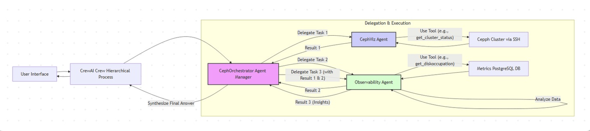

# MultiAgent-AI

**Multi-Agent System for Autonomous Ceph Cluster Management**

This project implements an intelligent, multi-agent orchestration system for monitoring, analyzing, and managing Ceph storage clusters using [CrewAI](https://github.com/joaomdmoura/crewAI). At its core, a centralized `CephOrchestrator` agent coordinates a team of specialized agents to perform real-time cluster health checks, bug triage, documentation lookups, performance monitoring, and automated recommendations.

Key Features:
- 🔍 **Cluster Status Evaluation** via CephViz Agent  
- 📊 **Performance & Disk Analysis** via Observability Agent  
- 🐞 **Bug Monitoring** via CephBugAgent (Bugzilla Integration)  
- 📚 **Ceph Docs Lookup** via CephDocAgent  
- 🧠 **Automated Health Recommendations** via CephAdvisor Agent  
- 🤖 **Hierarchical Task Planning** using CrewAI-style orchestration  


🧱 Built With:
- Python, [CrewAI](https://github.com/joaomdmoura/crewAI), LangChain Tools
- Ceph CLI + SSH, Metrics via PostgreSQL, Bugzilla API, Ceph Docs Search

## Support matrix
Python - 3.11

## Architecture


## Installation

1. Install `uv` package manager: https://docs.astral.sh/uv/getting-started/installation/


2. # Initialize and update all git submodules  
```bash
git submodule update --init --recursive
```

3. Sync dependencies:
```bash
uv sync
```

4. Optional - if you want to use python 3.11.x when you have multiple python versions installed.
 ``` bash
 uv venv -p 3.11
 source .venv/bin/activate
 ```

5. Download model
```bash
uv pip install sentence-transformers
python -c 'from sentence_transformers import SentenceTransformer; model = SentenceTransformer("all-MiniLM-L6-v2"); model.save("data/models/all-MiniLM-L6-v2")'
```
Verify that a folder called `all-MiniLM-L6-v2` is created in `data/models` directory.

6. Create Gemini LLM API key and place it in `.env`

## Get the documentation

```bash
cd src/
uv run scripts/scrape_ceph_documentation.py --branch <branch-you-want-to-scrape>
```

## Create FAISS index

```bash
cd src/
uv run agents/maverick/src/maverick/backend/parse_documentation.py
```

Note: Ensure that both the `.txt` and `.faiss` files are located in the directory specified by the `DOCUMENTATION` path in the `.env` file.


## Running the backend

```bash
cd src
uv run orchestration/flow.py
```

## Running the frontend

```bash
cd src
uv run streamlit run frontend/app.py
```

## Run as docker

Important: If you are a MAC user, uncomment platform field in `docker-compose.yml` before running following command.

```bash
docker-compose --env-file .env -f docker/docker-compose.yml up --build
```


### Submodule Setup

1. **Add Agent Submodules**

```bash
git submodule add https://github.ibm.com/Chebrolu-Harika/maverick src/agents/maverick
git submodule add https://github.ibm.com/Chebrolu-Harika/Bug-Intelligence src/agents/bug_intelligence
git submodule add https://github.ibm.com/Chebrolu-Harika/cephViz src/agents/cephviz
git submodule add https://github.ibm.com/Chebrolu-Harika/observability src/agents/observability
git submodule add https://github.ibm.com/Chebrolu-Harika/perf src/agents/perf
```

2. **Initialize with `uv` and Install Dependencies**

```bash
# Initialize all agent libraries
cd src/agents

uv init --lib maverick
uv init --lib bug_intelligence
uv init --lib cephviz
uv init --lib observability
uv init --lib perf
```

3. **Install Backend Requirements**

```bash
# cephviz backend requirements
cd cephviz
uv add -r src/cephviz/backend/requirements.txt
cd ..

# observability backend requirements
cd observability
uv add -r src/observability/backend/requirements.txt
cd ..

# perf backend requirements
cd perf
uv add -r src/perf/backend/requirements.txt
cd ..
```
